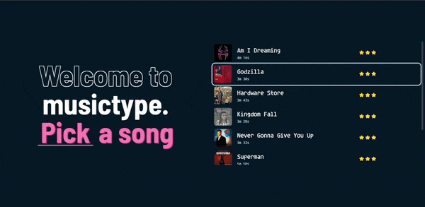
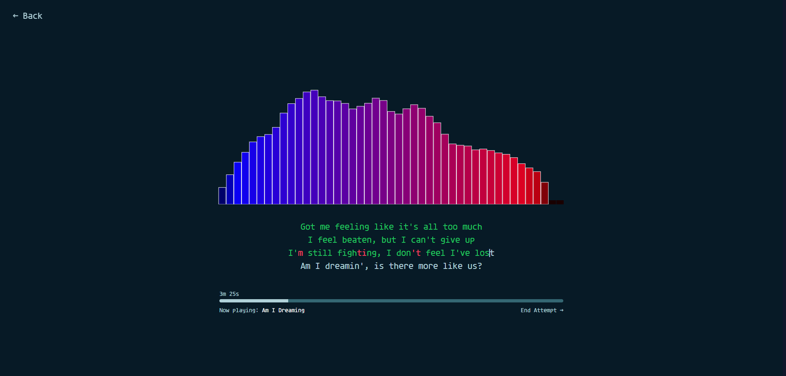
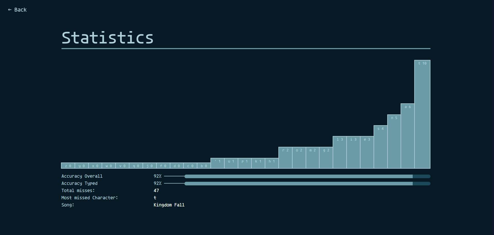

# musictype

## What is this
You type line synced lyrics, pretty straightforward.

Built with:
 - Vue3
 - Tailwind
 - Typescript
 - Vite

## Running the dev server
You have to run two separate dev servers, one for the frontend and one for the backend
Run `npm run dev` inside the client and server folders, the app will be available on port 5173 of localhost

## Building
The client and the server are built separately by running `npm run build` in their corresponding folders.
The client build is put inside `client/clientDist` and the server build is put inside `server/serverDist`

However, these two need to be combined to properly to function as one app. If you dont want to do that manually, you can run `build.sh` which 1. builds the server, 2. builds the client, 3. combines both builds and puts them in `server/dist` (is this bad practice?)

## Known issues
 - Wonky behaviour when you go to the previous line with backspace (or ctrl + backspace)
 - Literally zero error handling

## Preview

